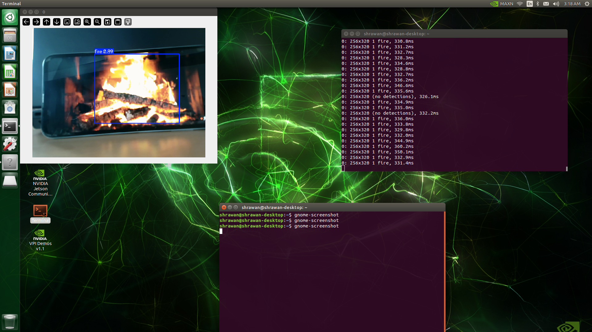
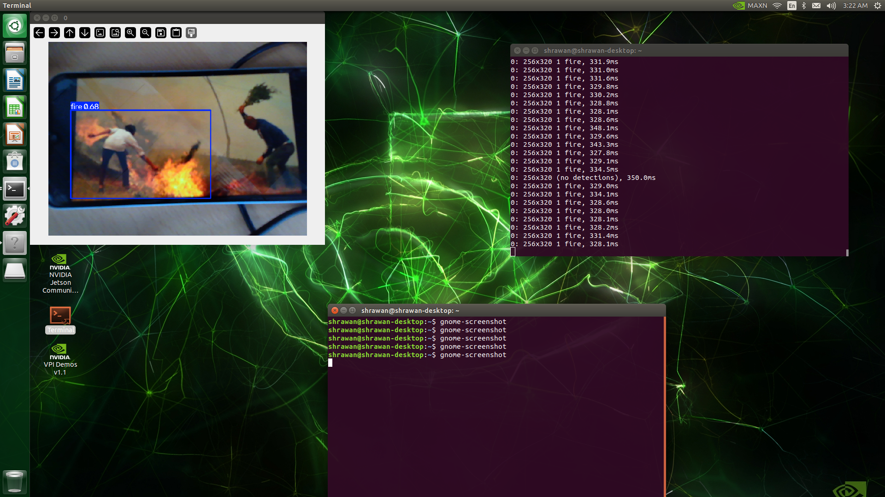
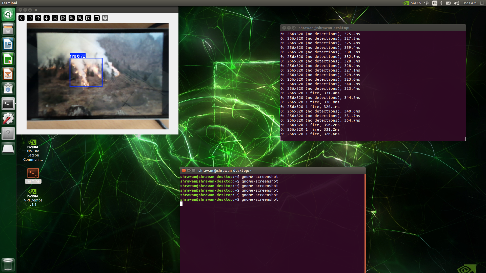

# 🔥 Fire and Smoke Detection System (Edge AI)

Real-time fire and smoke detection running on an **NVIDIA Jetson Nano**, powered by **YOLOv8**. Built during a 2-day technical workshop at the **Nepal Technology Innovation Center (NTIC), Kathmandu University**, this project demonstrates low-latency object detection on edge hardware — no cloud inference required.

> **Note:** This project is for **educational purposes only** and is not intended for production or commercial fire-safety deployment without further testing, validation, and certification. Feel free to use it as a reference for your own learning or projects — we'd just appreciate a mention/credit to the original contributors listed below. 🙌

## 📋 Table of Contents

* [Overview](#overview)
* [Tech Stack](#tech-stack)
* [Hardware Setup](#hardware-setup)
* [Project Structure](#project-structure)
* [Getting Started](#getting-started)
* [Usage](#usage)
* [Results](#results)
* [Contributors](#contributors)
* [Special Thanks](#special-thanks)

## Overview

This system uses a custom-trained YOLOv8 model to detect fire and smoke in real time from a live camera feed. Inference runs entirely on-device on the Jetson Nano, making it suitable for standalone deployment in environments where early fire detection matters — warehouses, forests, industrial sites, or home safety setups — without needing constant internet connectivity.

## Tech Stack

| Component | Details |
| --- | --- |
| **Hardware** | NVIDIA Jetson Nano |
| **Model** | Ultralytics YOLOv8 (custom-trained) |
| **Language** | Python |
| **Computer Vision** | OpenCV |
| **Deep Learning Backend** | PyTorch |

## Hardware Setup

The system was deployed on an NVIDIA Jetson Nano paired with a camera module for live video capture.

<p float="left">
  
  
</p>

## Project Structure

```
.
├── assets/             # Images used in this README and sample outputs
├── best.pt             # Trained YOLOv8 model weights
├── detect.py           # Main script for running real-time detection
├── requirements.txt    # Python dependencies
└── README.md
```

## Getting Started

### Prerequisites

* NVIDIA Jetson Nano (or any machine with a CUDA-capable GPU / CPU for testing)
* Python 3.8+
* A connected USB/CSI camera (for live detection)

### Installation

1. Clone this repository:

```bash
git clone https://github.com/<your-username>/<your-repo-name>.git
cd <your-repo-name>
```

2. (Recommended) Create and activate a virtual environment:

```bash
python3 -m venv venv
source venv/bin/activate
```

3. Install dependencies:

```bash
pip install -r requirements.txt
```

## Usage

Run detection using the pretrained weights (`best.pt`) included in this repo:

```bash
python detect.py
```

> **Note:** Depending on how `detect.py` is configured, you may need to pass arguments such as the model path or video source, e.g.:
> ```bash
> python detect.py --weights best.pt --source 0
> ```
> Update this section with the exact flags your script supports.

The script will open a live camera feed and draw bounding boxes around any detected fire or smoke regions in real time.

## Results

The model reliably detects fire in varied lighting and background conditions. Below are sample detections from live testing on the Jetson Nano (view more in `assets/`):

<p float="left">
  
  
  
</p>
<p float="left">
  
</p>

## Contributors

* **Sudarshan Rijal**
* **Sushant Roy Yadav**
* **Ankit Sigdel**
* **Sakshyam Timsina**

## Special Thanks To:

* **Prof. Dr. Sudan Jha**
* **Er. Shrawan Thakur**
* **Er. Ayush Poudel**

*Built as part of a hands-on Edge AI workshop at the Nepal Technology Innovation Center (NTIC), Kathmandu University, exploring real-time computer vision on embedded hardware.*
